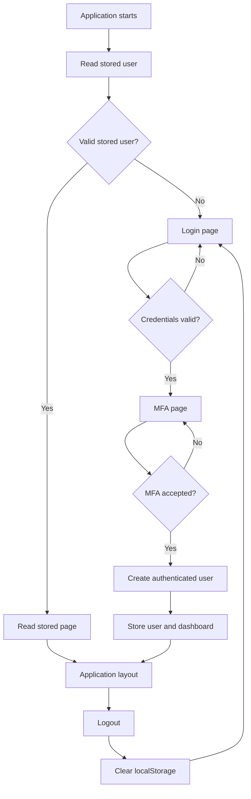
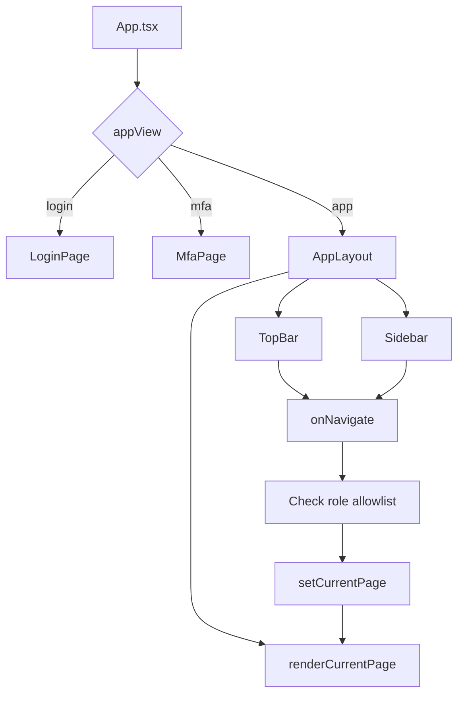

# AthenaSec Development Documentation

**File:** `athenasec_dev.md`  
**Snapshot date:** 3 August 2026  
**Project:** AthenaSec frontend migration from static HTML/CSS/JavaScript to Vite + React + TypeScript

# Phase 1 — React Migration

## AthenaSec React Migration — Full Technical Documentation

## Accuracy and completeness notice

This document was assembled from the current project conversation, the uploaded migration log, and the source files that were available in the uploaded-file context.

The project history confirms that the original prototype used `index.html`, `css/styles.css`, and `js/app.js`, and that the React migration split the interface into page components and shared layout components.

Some complete source files were not available in full through the uploaded-file context. Where a complete file could not be recovered, this document explicitly states:

> This information was not available in the session or uploaded files.

No missing code has been invented.

---

## Table of contents

1. Original website state
2. Development environment setup
3. React project structure
4. Chronological migration process
5. Old-to-new file mapping
6. Authentication and refresh persistence
7. Navigation architecture
8. Component documentation
9. Function reference
10. Styling migration
11. TypeScript conversion
12. Errors and troubleshooting
13. Current project status
14. Remaining work
15. How to run the project
16. Source-code archive
17. Verification checklist

---

# 1. Original website state

## 1.1 Original structure

```text
prototype/
├── index.html
├── css/
│   └── styles.css
├── js/
│   └── app.js
├── Details.md
└── README.md
```

Some uploaded copies used names such as:

```text
index(1).html
styles(1).css
app(1).js
Details(1).md
```

The HTML expected `css/styles.css` and `js/app.js`, so the files either had to be renamed and moved into those folders or the references in the HTML had to be changed.

## 1.2 Original architecture

The prototype was a single-page static application:

```text
index.html
  ├── Login view
  ├── MFA view
  ├── Authenticated application shell
  │   ├── Top bar
  │   ├── Sidebar
  │   └── Every application page as an HTML section
  └── Modal root

styles.css
  └── Entire visual design and responsive behavior

app.js
  └── Authentication, navigation, filters, search, modals, tables,
      profile actions, role checks, and simulated management actions
```

The original site did not use real browser routes. JavaScript showed and hid sections by changing classes and attributes.

## 1.3 Original pages

The original HTML contained:

- Login
- MFA
- Analyst dashboard
- Administrator dashboard
- Alerts
- Alert detail and AI-analysis content
- Case management
- Incident response / response activity
- Configuration
- Detection rules
- Response policies
- Integrations
- User management
- Audit logs
- System health
- Settings
- Profile

## 1.4 Original JavaScript responsibilities

The original `app.js` handled:

- Hard-coded demo login
- Static MFA code
- Remembered email
- Role-aware access
- Page navigation
- Top-bar dropdowns
- Global search
- Alert filters and sorting
- Incident filters and status updates
- Detection-rule actions
- Integration synchronization
- User-management actions
- Profile updates
- Modals and confirmation dialogs
- Logout

## 1.5 Original data

All original data was mock or hard-coded.

| Role | Email | Password |
|---|---|---|
| Analyst | `analyst@athenasec.com` | `analyst123` |
| Administrator | `admin@athenasec.com` | `admin123` |

MFA demo code:

```text
123456
```

There was no backend, database, API, secure server authentication, Wazuh connection, OpenSearch query, TheHive connection, or persistent data layer.

## 1.6 Original assets

The AthenaSec logo square was created through CSS using `.logo:before`, so an image file was not required for that element.

A complete inventory of images, fonts, icon files, and other assets was not available in the accessible session.

## 1.7 Complete original source availability

### `index.html`

This information was not available in the session or uploaded files as a complete recoverable file.

### `css/styles.css`

This information was not available as a complete original file. The current `src/athenasec.css` was copied from and later extended beyond the original stylesheet.

### `js/app.js`

This information was not available as a complete recoverable file. Its documented responsibilities are preserved in this document.

---

# 2. Development environment setup

## 2.1 Selected stack

- **Vite** — development server and production build tool
- **React** — component-based user-interface library
- **TypeScript** — typed JavaScript
- **TSX** — TypeScript files containing React markup

React was selected because AthenaSec contains many stateful dashboards, forms, tables, filters, drawers, and role-specific pages.

## 2.2 Commands discussed

```bash
node --version
npm --version
npm create vite@latest
npm install
npm run dev
npm run build
npm run preview
```

The migration log confirms:

- A Vite React TypeScript project was created.
- The development server worked.
- A production build succeeded.
- React Router remained installed but was not used by the current navigation architecture.

The exact initial Vite wizard transcript was not preserved.

## 2.3 Command meanings

| Command | Purpose |
|---|---|
| `node --version` | Checks whether Node.js is installed |
| `npm --version` | Checks whether npm is installed |
| `npm create vite@latest` | Creates a Vite project |
| `npm install` | Installs dependencies |
| `npm run dev` | Starts the Vite development server |
| `npm run build` | Creates a production build |
| `npm run preview` | Serves the production build locally |

## 2.4 Correct directory

Run npm commands from the folder containing:

```text
package.json
```

Example:

```bash
cd /path/to/athenasec/frontend
npm run dev
```

Vite prints a local URL, commonly similar to:

```text
http://localhost:5173/
```

Use the exact URL printed in the terminal.

## 2.5 Stop and restart

Stop:

```text
Ctrl+C
```

Restart:

```bash
npm run dev
```

## 2.6 Operating system context

The project was being edited and tested on Arch Linux. The npm and Vite commands are the same as on Windows and macOS; only filesystem paths differ.

---

# 3. React project structure

```text
frontend/
├── public/
├── src/
│   ├── components/
│   │   ├── AppLayout.tsx
│   │   ├── Sidebar.tsx
│   │   └── TopBar.tsx
│   ├── pages/
│   │   ├── LoginPage.tsx
│   │   ├── MfaPage.tsx
│   │   ├── AnalystDashboardPage.tsx
│   │   ├── AdminDashboardPage.tsx
│   │   ├── AlertsPage.tsx
│   │   ├── CasesPage.tsx
│   │   ├── IncidentResponsePage.tsx
│   │   ├── ConfigurationPage.tsx
│   │   ├── DetectionRulesPage.tsx
│   │   ├── ResponsePoliciesPage.tsx
│   │   ├── IntegrationsPage.tsx
│   │   ├── UserManagementPage.tsx
│   │   ├── AuditLogsPage.tsx
│   │   ├── SystemHealthPage.tsx
│   │   ├── SettingsPage.tsx
│   │   └── ProfilePage.tsx
│   ├── App.tsx
│   ├── main.tsx
│   ├── athenasec.css
│   ├── react-stability.css
│   ├── integrations-table-fix.css
│   └── user-management-table-fix.css
├── index.html
├── package.json
├── tsconfig.json
├── tsconfig.app.json
├── tsconfig.node.json
└── vite.config.ts
```

## Directory purposes

| Directory | Purpose |
|---|---|
| `src/components` | Shared shell components used across pages |
| `src/pages` | One React page component for each AthenaSec screen |
| `src` | Main application source |
| `public` | Static files served without bundling |

The original one-file HTML structure was split into page components. The original one-file JavaScript logic was split into React state and event handlers owned by the page that uses them.

---

# 4. Chronological migration process

## 4.1 Initial review

The static prototype was reviewed first. The main implementation decision was to preserve the visual identity while rebuilding the internal structure with React.

## 4.2 Vite project creation

A Vite React TypeScript project was created. The original CSS was copied into:

```text
src/athenasec.css
```

and imported from `main.tsx`.

## 4.3 HTML-to-TSX conversion

Important conversion rules:

| HTML | TSX |
|---|---|
| `class` | `className` |
| `for` | `htmlFor` |
| Inline style strings | JavaScript style objects |
| `<input>` | `<input />` |
| Static checked input | `defaultChecked` |
| Static value | `defaultValue` |
| Interactive value | Controlled `value` and `onChange` |

CSS custom properties required a type assertion:

```tsx
style={{ '--donut-pct': 42 } as React.CSSProperties}
```

## 4.4 Page splitting

All visible screens were converted into separate `.tsx` page files.

The Analyst and Administrator dashboards were separated so role content would not be mixed.

A documented original HTML nesting problem placed part of the Analyst dashboard outside the intended role wrapper. The migrated React component placed that content inside `AnalystDashboardPage.tsx`.

## 4.5 Shared layout extraction

The shared layout became:

```text
AppLayout
├── TopBar
└── Body
    ├── Sidebar
    └── Current page
```

This avoided repeating the top bar and sidebar on every page.

## 4.6 State-based navigation

`App.tsx` stored the current page in React state:

```tsx
const [currentPage, setCurrentPage] = useState('dashboard')
```

The selected page was rendered through a switch statement.

React Router was not used.

Role-specific allowlists were added so Analysts could not navigate to Administrator pages through the application state.

## 4.7 Authentication reconnection

Login and MFA were reconnected to `App.tsx`.

Current flow:

```text
Login
  ↓ valid demo credentials
MFA
  ↓ accepted demo code
Authenticated application
```

## 4.8 Page-by-page functionality

The project then converted static controls into React state and event handlers for:

- Analyst dashboard
- Alerts
- Case management
- Incident response
- Administrator dashboard
- Detection rules
- Integrations
- Response policies
- User management
- Audit logs
- Configuration
- System health
- Settings
- Profile

Most changes remain frontend-only and reset after a reload unless explicitly stored.

## 4.9 Table-animation stability

Filtering caused rows or pages to replay CSS animations and visually jump.

A new stylesheet was created:

```text
src/react-stability.css
```

It disabled or stabilized row/page animation and layout behavior.

Incident Response used:

```text
data-page="response-activity"
```

and was added to the stability rules.

## 4.10 Integrations action clipping

The Integrations table clipped or hid actions such as:

- View
- Sync
- Connect

A dedicated stylesheet was created:

```text
src/integrations-table-fix.css
```

The user confirmed the result worked.

## 4.11 User Management action clipping

User Management actions were similarly clipped.

A dedicated stylesheet was created:

```text
src/user-management-table-fix.css
```

The user confirmed the result worked.

## 4.12 Configuration page

The page changed from static `defaultValue` fields and inactive buttons to controlled React state with:

- Draft detection
- Save
- Cancel
- Restore defaults
- Numeric validation
- Retention validation
- Frontend-session-only state

## 4.13 System Health page

The page gained:

- Simulated refresh
- Metric updates
- Service search
- Status filtering
- Individual service checks
- Check-all action
- Service detail drawer
- Processing totals
- Recent health events

No real AthenaSec infrastructure is contacted.

## 4.14 Settings page

Settings gained controlled:

- Theme
- Language
- Notifications
- Notification categories
- Session timeout
- Auto-logout warning
- MFA
- Sensitive-action MFA
- Save
- Cancel
- Restore defaults

The current page does not implement a real application-wide theme engine or real MFA configuration.

## 4.15 Profile page and real email

`ProfilePage.tsx` initially received no account props, so it used:

```text
user@athenasec.com
```

as its fallback.

`App.tsx` was updated to pass the current user:

```tsx
<ProfilePage
  userName={currentUser?.name}
  userEmail={currentUser?.email}
  role={currentUser?.role}
/>
```

The user initially still saw the old value because the active session had not been restarted. After signing out and signing back in, the correct email appeared.

## 4.16 Refresh persistence

Refreshing originally reset React state and returned to login.

Persistence was added using:

```text
localStorage
```

Keys:

```text
athenasec-authenticated-user
athenasec-current-page
```

Only name, email, and role are stored by the new persistence logic. The password and MFA code are not stored.

## 4.17 TypeScript `role` error

The first stored-user validator used a separate boolean to validate the role. TypeScript did not narrow `parsedUser.role` at the return statement.

The fix was to compare the allowed role values directly inside the validation condition:

```tsx
parsedUser.role !== 'Analyst' &&
parsedUser.role !== 'Administrator'
```

After that check, TypeScript recognizes `parsedUser.role` as the valid role union.

---

# 5. Old-to-new file mapping

| Original area | React equivalent | Status |
|---|---|---|
| Authentication HTML | `LoginPage.tsx`, `MfaPage.tsx`, `App.tsx` | Migrated |
| Application shell | `AppLayout.tsx`, `TopBar.tsx`, `Sidebar.tsx` | Migrated |
| Analyst dashboard | `AnalystDashboardPage.tsx` | Migrated |
| Admin dashboard | `AdminDashboardPage.tsx` | Migrated |
| Alerts | `AlertsPage.tsx` | Migrated |
| Cases/incidents | `CasesPage.tsx` | Migrated |
| Response activity | `IncidentResponsePage.tsx` | Migrated |
| Configuration | `ConfigurationPage.tsx` | Migrated |
| Detection rules | `DetectionRulesPage.tsx` | Migrated |
| Response policies | `ResponsePoliciesPage.tsx` | Migrated |
| Integrations | `IntegrationsPage.tsx` | Migrated |
| User management | `UserManagementPage.tsx` | Migrated |
| Audit logs | `AuditLogsPage.tsx` | Migrated |
| System health | `SystemHealthPage.tsx` | Migrated |
| Settings | `SettingsPage.tsx` | Migrated |
| Profile | `ProfilePage.tsx` | Migrated |
| `styles.css` | `athenasec.css` plus fix stylesheets | Reused and extended |
| `app.js` navigation | `App.tsx`, `Sidebar.tsx`, `TopBar.tsx` | Migrated |
| `app.js` page actions | Page-owned React functions | Migrated as simulations |
| `app.js` session handling | `App.tsx` and `localStorage` | Migrated for prototype |
| Shared Modal | Per-page implementations | Not centralized |
| Shared Drawer | Per-page implementations | Not centralized |
| Backend/API | None | Not implemented |

---

# 6. Authentication and refresh persistence

## 6.1 Flow



## 6.2 Why refresh previously logged out

React state exists only in memory. Refreshing destroys the current JavaScript instance. Before persistence, `currentUser` returned to `null` and the application view returned to login.

## 6.3 Persistence method

The prototype now restores a validated user and page from `localStorage`.

Stored user shape:

```ts
type AuthenticatedUser = {
  email: string
  role: 'Analyst' | 'Administrator'
  name: string
}
```

Invalid JSON or invalid user fields are removed.

## 6.4 Security status

The current authentication is:

- Frontend demonstration
- Mock authentication
- Not connected to a backend
- Not production-safe

A production implementation should use backend authentication, secure `HttpOnly` cookies, server-side authorization, password hashing, real MFA, rate limiting, and server-side session validation.

---

# 7. Navigation architecture

The current implementation uses React state rather than React Router.



Advantages:

- Simple for a prototype
- No route configuration
- Role checks are centralized
- Similar to the original single-page behavior

Limitations:

- No bookmarkable page URLs
- Browser Back and Forward do not track internal pages
- No deep linking
- No route-based code splitting
- A larger application should use React Router

---

# 8. Component documentation

## `src/App.tsx`

**Purpose:** authentication state, role access, page selection, refresh persistence, and page rendering.

**State:**

- `currentUser`
- `appView`
- `currentPage`
- `pendingUser`

**Functions:**

- `readStoredUser`
- `readStoredPage`
- `handleLogin`
- `handleMfaVerify`
- `navigate`
- `logout`
- `renderCurrentPage`

**Limitations:** hard-coded users, localStorage-based identity, no server session.

## `src/components/TopBar.tsx`

**Purpose:** logo, system status, search input, notifications, user menu, profile/settings navigation, logout.

**Props:**

- `userName`
- `role`
- `onNavigate`
- `onLogout`

**State:**

- `notificationOpen`
- `userMenuOpen`

**Limitations:** global search is not confirmed as fully connected to all page data.

## `src/components/Sidebar.tsx`

**Purpose:** role-specific navigation, active-page styling, and logout.

Complete latest source was not available in the accessible uploaded context.

## `src/components/AppLayout.tsx`

**Purpose:** wraps the TopBar, Sidebar, and selected page.

Complete latest source was not available in the accessible uploaded context.

## Authentication pages

`LoginPage.tsx` passes email and password to `App.tsx`.

`MfaPage.tsx` uses six one-character inputs, numeric filtering, focus movement, and a verification callback in the latest documented implementation.

## Page components

Each page owns its own state, mock data, filters, selected record, forms, and action handlers. This replaced the original pattern of keeping every behavior in one `app.js` file.

---

# 9. Function reference

| Function | File | Purpose | Status |
|---|---|---|---|
| `readStoredUser` | `App.tsx` | Parse and validate stored identity | Implemented |
| `readStoredPage` | `App.tsx` | Restore a role-allowed page | Implemented |
| `handleLogin` | `App.tsx` | Match demo credentials | Implemented |
| `handleMfaVerify` | `App.tsx` | Create authenticated user | Implemented |
| `navigate` | `App.tsx` | Enforce role allowlist and select page | Implemented |
| `logout` | `App.tsx` | Clear state and storage | Implemented |
| `renderCurrentPage` | `App.tsx` | Return selected page component | Implemented |
| `openNotifications` | `TopBar.tsx` | Toggle notification dropdown | Implemented |
| `openUserMenu` | `TopBar.tsx` | Toggle user dropdown | Implemented |
| `nextStatus` | Page status logic | Calculate next record status | Error discussed and later fixed; exact source unavailable |
| Integration sync handler | `IntegrationsPage.tsx` | Update status and last-sync text | Confirmed working |
| Configuration handlers | `ConfigurationPage.tsx` | Validate/save/cancel/defaults | Implemented |
| Health handlers | `SystemHealthPage.tsx` | Simulated checks and refresh | Implemented |
| Settings handlers | `SettingsPage.tsx` | Controlled settings and validation | Implemented |
| Profile handlers | `ProfilePage.tsx` | Controlled profile editing | Implemented |

---

# 10. Styling migration

The original CSS was copied into:

```text
src/athenasec.css
```

The migrated design preserved:

- Dark enterprise theme
- Top bar
- Sidebar
- Cards
- Statistics
- Tables
- Buttons
- Pills
- Forms
- Charts
- Donuts
- Dropdowns
- Modals
- Drawers
- Responsive rules

## 10.1 Scroll correction

The original CSS used:

```css
body {
  overflow: hidden;
}
```

The migration added:

```css
html,
body,
#root {
  min-height: 100%;
  overflow-y: auto;
}

body {
  margin: 0;
}

#root {
  width: 100%;
}
```

## 10.2 React stability

`react-stability.css` was added to stop page and row animations from replaying during filtering and rerendering.

## 10.3 Table fixes

The following stylesheets were added:

```text
src/integrations-table-fix.css
src/user-management-table-fix.css
```

They load after `athenasec.css` so they can override the base table layout.

---

# 11. TypeScript conversion

## 11.1 Important types

```ts
type Role = 'Analyst' | 'Administrator'
type AppView = 'login' | 'mfa' | 'app'
```

Page files also introduced union types for:

- Status
- Severity
- Health level
- Service status
- Configuration state
- Settings state
- Profile state

## 11.2 Event typing

Examples:

```ts
ChangeEvent<HTMLInputElement>
ChangeEvent<HTMLSelectElement>
FormEvent<HTMLFormElement>
CSSProperties
```

## 11.3 Known type issue

TypeScript did not narrow the optional stored `role` when validation was hidden behind a separate boolean.

The direct comparison fixed it:

```tsx
if (
  parsedUser.role !== 'Analyst' &&
  parsedUser.role !== 'Administrator'
) {
  return null
}
```

## 11.4 Remaining type improvements

- Create one shared `Role` type.
- Create a shared `PageId` union instead of using `string`.
- Move repeated mock-data interfaces into shared type files.
- Centralize integration, alert, case, and user types.

---

# 12. Errors and troubleshooting

| Error or symptom | Area | Cause | Fix | Status |
|---|---|---|---|---|
| Refresh returns to login | `App.tsx` | Memory-only state | Restore user/page from localStorage | Implemented |
| Profile shows `user@athenasec.com` | Profile route | No user props passed | Pass name/email/role from current user | Confirmed |
| Email updated only after sign-out/sign-in | Session state | Existing session predated new data flow | Restart authenticated flow | Confirmed |
| TypeScript error under `role` | `readStoredUser` | Incomplete type narrowing | Direct union comparison | Fixed |
| Rows jump during filtering | CSS | Animations replayed on rerender | `react-stability.css` | Fixed |
| Incident Response still jumped | CSS selector | `response-activity` omitted | Add page selector | Fixed |
| Integrations actions clipped | Integrations table | Width/overflow/sticky column conflict | Dedicated CSS fix | Confirmed |
| User actions clipped | User Management table | Similar table conflict | Dedicated CSS fix | Confirmed |
| `nextStatus` error | Status handler | Exact error unavailable | Typed status transition supplied | Reported fixed |
| Sync actions not visible | Integrations | Table action area hidden | CSS fix and import order | Fixed |
| Dropdown options missing | Form controls | Exact source unavailable | Options restored in later full-file replacements | Reported addressed |
| Admin Dashboard prop error | `App.tsx` | Missing `onNavigate` prop | Pass `onNavigate={navigate}` | User stated fixed |
| Page scrolling unavailable | Base CSS | `overflow: hidden` | Root/body scroll override | Fixed |
| Dashboard content in wrong role area | Original HTML | Incorrect closing-tag placement | Move content into Analyst component | Fixed |

---

# 13. Current project status

## Confirmed complete or functioning

- All visible pages converted to TSX
- Shared TopBar
- Shared Sidebar
- Shared AppLayout
- State-based navigation
- Role-specific page allowlists
- Login-to-MFA-to-app flow
- Logout
- Actual profile account data
- Refresh persistence implementation
- Analyst dashboard actions
- Alerts actions
- Case-management actions
- Incident-response actions
- Admin dashboard navigation
- Detection-rule actions
- Integration actions
- Response-policy actions
- User-management actions
- Audit-log actions
- Configuration actions
- System-health actions
- Settings actions
- Profile actions
- Integrations table fix
- User Management table fix
- React table stability fix

## Working with limitations

- Authentication is mock-only.
- MFA uses a static demo code.
- Session persistence uses localStorage.
- All data is hard-coded or simulated.
- Most page changes are not persisted to a backend.
- Charts are static, CSS-based, or simulated.
- System Health uses simulated values.
- Notifications do not send real messages.

## Not implemented

- Backend
- Database
- Real API
- Wazuh integration
- OpenSearch integration
- Suricata integration
- TheHive integration
- Ollama integration
- LangGraph integration
- Secure server session
- Real MFA
- Password hashing
- Server-side RBAC
- Shared Modal component
- Shared Drawer component
- React Router
- Automated tests
- Production deployment

---

# 14. Remaining work

## Immediate testing

1. Run `npm run dev`.
2. Check the terminal.
3. Check the browser console.
4. Test Analyst login.
5. Test every Analyst page.
6. Refresh on each Analyst page.
7. Log out.
8. Test Administrator login.
9. Test every Administrator page.
10. Refresh on each Administrator page.
11. Confirm Profile name, email, and role.
12. Test table actions.
13. Test sync and status changes.
14. Test save, cancel, and restore actions.
15. Test desktop, split-screen, tablet, and mobile widths.
16. Run `npm run build`.

## Functional improvements

- Replace mock data with API responses.
- Add loading states.
- Add error states.
- Add empty states.
- Add toast notifications.
- Persist changes to a backend.
- Add real pagination.
- Add real telemetry.

## Architecture improvements

- Add React Router.
- Create shared types.
- Centralize mock data.
- Add Auth Context.
- Add API service modules.
- Extract reusable tables, drawers, and modals.
- Add environment configuration.

## Production security

- Remove hard-coded credentials.
- Remove static MFA.
- Use backend authentication.
- Use secure cookies.
- Enforce server-side RBAC.
- Hash passwords.
- Add rate limiting.
- Validate input.
- Use parameterized database queries.
- Protect secrets.
- Add HTTPS.
- Configure CSP and CORS.
- Add audit logging.
- Add security testing.

---

# 15. How to run the project

## 15.1 Open the correct folder

Open the folder containing:

```text
package.json
```

In VS Code:

1. Open **File → Open Folder**.
2. Select the AthenaSec frontend folder.
3. Open **Terminal → New Terminal**.

## 15.2 Install and run

```bash
npm install
npm run dev
```

Open the URL printed by Vite.

## 15.3 Stop

```text
Ctrl+C
```

## 15.4 Restart

```bash
npm run dev
```

## 15.5 Build

```bash
npm run build
```

## 15.6 Preview

```bash
npm run preview
```

## 15.7 Common issues

### `npm: command not found`

Install Node.js and npm, then reopen the terminal.

### Missing dependency

```bash
npm install
```

### Wrong folder

Run:

```bash
ls
```

and confirm `package.json` is present.

---

# 16. Source-code archive

## 16.1 Latest documented `src/App.tsx`

```tsx
import { useEffect, useState } from 'react'

import AppLayout from './components/AppLayout'

import LoginPage from './pages/LoginPage'
import MfaPage from './pages/MfaPage'

import AnalystDashboardPage from './pages/AnalystDashboardPage'
import AdminDashboardPage from './pages/AdminDashboardPage'
import AlertsPage from './pages/AlertsPage'
import CasesPage from './pages/CasesPage'
import IncidentResponsePage from './pages/IncidentResponsePage'
import ConfigurationPage from './pages/ConfigurationPage'
import DetectionRulesPage from './pages/DetectionRulesPage'
import ResponsePoliciesPage from './pages/ResponsePoliciesPage'
import IntegrationsPage from './pages/IntegrationsPage'
import UserManagementPage from './pages/UserManagementPage'
import AuditLogsPage from './pages/AuditLogsPage'
import SystemHealthPage from './pages/SystemHealthPage'
import SettingsPage from './pages/SettingsPage'
import ProfilePage from './pages/ProfilePage'

type Role = 'Analyst' | 'Administrator'

type AppView = 'login' | 'mfa' | 'app'

type DemoAccount = {
  email: string
  password: string
  role: Role
  name: string
}

type AuthenticatedUser = {
  email: string
  role: Role
  name: string
}

const AUTH_STORAGE_KEY = 'athenasec-authenticated-user'
const PAGE_STORAGE_KEY = 'athenasec-current-page'

const DEMO_ACCOUNTS: DemoAccount[] = [
  {
    email: 'analyst@athenasec.com',
    password: 'analyst123',
    role: 'Analyst',
    name: 'Analyst A',
  },
  {
    email: 'admin@athenasec.com',
    password: 'admin123',
    role: 'Administrator',
    name: 'System Administrator',
  },
]

const analystPages = [
  'dashboard',
  'alerts',
  'incidents',
  'response-activity',
  'profile',
]

const adminPages = [
  'dashboard',
  'configuration',
  'detection-rules',
  'response-policies',
  'integrations',
  'user-management',
  'audit-logs',
  'system-health',
  'settings',
  'profile',
]

function readStoredUser(): AuthenticatedUser | null {
  try {
    const storedUser = localStorage.getItem(AUTH_STORAGE_KEY)

    if (!storedUser) {
      return null
    }

    const parsedUser = JSON.parse(
      storedUser,
    ) as Partial<AuthenticatedUser>

    if (
      typeof parsedUser.email !== 'string' ||
      typeof parsedUser.name !== 'string' ||
      (
        parsedUser.role !== 'Analyst' &&
        parsedUser.role !== 'Administrator'
      )
    ) {
      localStorage.removeItem(AUTH_STORAGE_KEY)
      return null
    }

    return {
      email: parsedUser.email,
      name: parsedUser.name,
      role: parsedUser.role,
    }
  } catch {
    localStorage.removeItem(AUTH_STORAGE_KEY)
    return null
  }
}

function readStoredPage(
  user: AuthenticatedUser | null,
): string {
  if (!user) {
    return 'dashboard'
  }

  const storedPage =
    localStorage.getItem(PAGE_STORAGE_KEY) ?? 'dashboard'

  const allowedPages =
    user.role === 'Administrator'
      ? adminPages
      : analystPages

  return allowedPages.includes(storedPage)
    ? storedPage
    : 'dashboard'
}

function App() {
  const [currentUser, setCurrentUser] =
    useState<AuthenticatedUser | null>(() =>
      readStoredUser(),
    )

  const [appView, setAppView] =
    useState<AppView>(() =>
      readStoredUser() ? 'app' : 'login',
    )

  const [currentPage, setCurrentPage] =
    useState<string>(() => {
      const storedUser = readStoredUser()
      return readStoredPage(storedUser)
    })

  const [pendingUser, setPendingUser] =
    useState<DemoAccount | null>(null)

  const role: Role =
    currentUser?.role ?? 'Analyst'

  useEffect(() => {
    if (!currentUser) {
      localStorage.removeItem(AUTH_STORAGE_KEY)
      return
    }

    localStorage.setItem(
      AUTH_STORAGE_KEY,
      JSON.stringify(currentUser),
    )
  }, [currentUser])

  useEffect(() => {
    if (appView !== 'app' || !currentUser) {
      return
    }

    localStorage.setItem(
      PAGE_STORAGE_KEY,
      currentPage,
    )
  }, [appView, currentPage, currentUser])

  function handleLogin(
    email: string,
    password: string,
  ) {
    const normalizedEmail =
      email.trim().toLowerCase()

    const account = DEMO_ACCOUNTS.find(
      (user) =>
        user.email === normalizedEmail &&
        user.password === password,
    )

    if (!account) {
      return false
    }

    setPendingUser(account)
    setAppView('mfa')

    return true
  }

  function handleMfaVerify() {
    if (!pendingUser) {
      setAppView('login')
      return
    }

    const authenticatedUser: AuthenticatedUser = {
      email: pendingUser.email,
      role: pendingUser.role,
      name: pendingUser.name,
    }

    setCurrentUser(authenticatedUser)
    setPendingUser(null)
    setCurrentPage('dashboard')
    setAppView('app')

    localStorage.setItem(
      AUTH_STORAGE_KEY,
      JSON.stringify(authenticatedUser),
    )

    localStorage.setItem(
      PAGE_STORAGE_KEY,
      'dashboard',
    )
  }

  function navigate(page: string) {
    const allowedPages =
      role === 'Administrator'
        ? adminPages
        : analystPages

    const nextPage = allowedPages.includes(page)
      ? page
      : 'dashboard'

    setCurrentPage(nextPage)

    localStorage.setItem(
      PAGE_STORAGE_KEY,
      nextPage,
    )
  }

  function logout() {
    setCurrentUser(null)
    setPendingUser(null)
    setCurrentPage('dashboard')
    setAppView('login')

    localStorage.removeItem(AUTH_STORAGE_KEY)
    localStorage.removeItem(PAGE_STORAGE_KEY)
  }

  function renderCurrentPage() {
    switch (currentPage) {
      case 'dashboard':
        return role === 'Administrator' ? (
          <AdminDashboardPage onNavigate={navigate} />
        ) : (
          <AnalystDashboardPage />
        )

      case 'alerts':
        return <AlertsPage />

      case 'incidents':
        return <CasesPage />

      case 'response-activity':
        return <IncidentResponsePage />

      case 'configuration':
        return <ConfigurationPage />

      case 'detection-rules':
        return <DetectionRulesPage />

      case 'response-policies':
        return <ResponsePoliciesPage />

      case 'integrations':
        return <IntegrationsPage />

      case 'user-management':
        return <UserManagementPage />

      case 'audit-logs':
        return <AuditLogsPage />

      case 'system-health':
        return <SystemHealthPage />

      case 'settings':
        return <SettingsPage />

      case 'profile':
        return (
          <ProfilePage
            userName={currentUser?.name}
            userEmail={currentUser?.email}
            role={currentUser?.role}
          />
        )

      default:
        return role === 'Administrator' ? (
          <AdminDashboardPage onNavigate={navigate} />
        ) : (
          <AnalystDashboardPage />
        )
    }
  }

  if (appView === 'login') {
    return <LoginPage onSignIn={handleLogin} />
  }

  if (appView === 'mfa') {
    return <MfaPage onVerify={handleMfaVerify} />
  }

  if (!currentUser) {
    return <LoginPage onSignIn={handleLogin} />
  }

  return (
    <AppLayout
      role={currentUser.role}
      userName={currentUser.name}
      currentPage={currentPage}
      onNavigate={navigate}
      onLogout={logout}
    >
      {renderCurrentPage()}
    </AppLayout>
  )
}

export default App
```

## 16.2 Current available `src/components/TopBar.tsx`

```tsx
import { useState } from 'react'

type TopBarProps = {
  userName: string
  role: 'Analyst' | 'Administrator'
  onNavigate: (page: string) => void
  onLogout: () => void
}

function TopBar({
  userName,
  role,
  onNavigate,
  onLogout,
}: TopBarProps) {
  const [notificationOpen, setNotificationOpen] = useState(false)
  const [userMenuOpen, setUserMenuOpen] = useState(false)

  function openNotifications() {
    setNotificationOpen(!notificationOpen)
    setUserMenuOpen(false)
  }

  function openUserMenu() {
    setUserMenuOpen(!userMenuOpen)
    setNotificationOpen(false)
  }

  function navigate(page: string) {
    setNotificationOpen(false)
    setUserMenuOpen(false)
    onNavigate(page)
  }

  return (
    <div className="topbar">
      <button
        className="logo"
        onClick={() => navigate('dashboard')}
      >
        AthenaSec
      </button>

      <div
        className="system-status-widget"
        aria-label="System status"
      >
        <span
          className="status-indicator"
          aria-hidden="true"
        />

        <span className="status-copy">
          <strong>System Online</strong>
          <small>All Systems Operational</small>
        </span>
      </div>

      <div className="search-wrap">
        <input
          className="search-input"
          id="globalSearch"
          placeholder="Search alerts, cases, responses, policies..."
        />
      </div>

      <div className="top-actions">
        <div className="dropdown-wrap">
          <button
            className="icon-btn"
            onClick={openNotifications}
          >
            <span className="bell-shape" />
            <span className="badge-dot" />
          </button>

          {notificationOpen && (
            <div className="dropdown">
              <button
                className="drop-item"
                onClick={() => navigate('alerts')}
              >
                <strong>New Alert</strong>
                <p>
                  ALT-004 Kernel Exploit Attempt scored Critical.
                </p>
              </button>

              <button
                className="drop-item"
                onClick={() => navigate('incidents')}
              >
                <strong>Case Created</strong>
                <p>
                  CASE-008 was created from endpoint-09 telemetry.
                </p>
              </button>

              {role === 'Administrator' && (
                <>
                  <button
                    className="drop-item"
                    onClick={() => navigate('response-policies')}
                  >
                    <strong>Policy Updated</strong>
                    <p>
                      Critical Host Isolation policy was validated.
                    </p>
                  </button>

                  <button
                    className="drop-item"
                    onClick={() => navigate('system-health')}
                  >
                    <strong>System Warning</strong>
                    <p>
                      Telemetry sync latency is above the expected threshold.
                    </p>
                  </button>
                </>
              )}
            </div>
          )}
        </div>

        <div className="dropdown-wrap">
          <button
            className="user-chip"
            onClick={openUserMenu}
          >
            {userName}
          </button>

          {userMenuOpen && (
            <div className="dropdown">
              <button
                className="drop-item"
                onClick={() => navigate('profile')}
              >
                <strong>Profile</strong>
                <p>View role, contact, and session details.</p>
              </button>

              {role === 'Administrator' && (
                <button
                  className="drop-item"
                  onClick={() => navigate('settings')}
                >
                  <strong>Settings</strong>
                  <p>
                    Manage console theme, MFA, and session timeout.
                  </p>
                </button>
              )}

              <button
                className="drop-item"
                onClick={onLogout}
              >
                <strong>Logout</strong>
                <p>End the current AthenaSec session.</p>
              </button>
            </div>
          )}
        </div>
      </div>
    </div>
  )
}

export default TopBar
```

## 16.3 Latest documented `src/main.tsx`

```tsx
import { StrictMode } from 'react'
import { createRoot } from 'react-dom/client'
import './athenasec.css'
import './react-stability.css'
import './integrations-table-fix.css'
import './user-management-table-fix.css'
import App from './App.tsx'

createRoot(document.getElementById('root')!).render(
  <StrictMode>
    <App />
  </StrictMode>,
)
```

## 16.4 Complete files not recoverable

The following latest complete files were not available in the accessible session or uploaded-file context:

```text
src/components/Sidebar.tsx
src/components/AppLayout.tsx
src/pages/LoginPage.tsx
src/pages/MfaPage.tsx
src/pages/AnalystDashboardPage.tsx
src/pages/AdminDashboardPage.tsx
src/pages/AlertsPage.tsx
src/pages/CasesPage.tsx
src/pages/IncidentResponsePage.tsx
src/pages/ConfigurationPage.tsx
src/pages/DetectionRulesPage.tsx
src/pages/ResponsePoliciesPage.tsx
src/pages/IntegrationsPage.tsx
src/pages/UserManagementPage.tsx
src/pages/AuditLogsPage.tsx
src/pages/SystemHealthPage.tsx
src/pages/SettingsPage.tsx
src/pages/ProfilePage.tsx
src/athenasec.css
src/react-stability.css
src/integrations-table-fix.css
src/user-management-table-fix.css
package.json
vite.config.ts
tsconfig.json
tsconfig.app.json
tsconfig.node.json
index.html
```

These files should be exported directly from the current project directory to create a byte-for-byte archive.

---

# 17. Verification checklist

## Verified

- [x] Original architecture documented
- [x] Original file purposes documented
- [x] Demo credentials documented
- [x] Vite/React/TypeScript setup documented
- [x] Page structure documented
- [x] Shared layout documented
- [x] Navigation documented
- [x] Authentication documented
- [x] Profile email issue documented
- [x] Refresh persistence documented
- [x] TypeScript role issue documented
- [x] Table stability fixes documented
- [x] Integrations table fix documented
- [x] User Management table fix documented
- [x] Current limitations documented
- [x] Run/build/preview instructions documented
- [x] Latest documented `App.tsx` included
- [x] Complete available `TopBar.tsx` included
- [x] Latest documented `main.tsx` included

## Unavailable for byte-for-byte verification

- [ ] Complete original `index.html`
- [ ] Complete original `styles.css`
- [ ] Complete original `app.js`
- [ ] Complete latest source for every page component
- [ ] Complete latest Sidebar and AppLayout
- [ ] Complete current CSS files without retrieval truncation
- [ ] Complete package and Vite/TypeScript configuration files
- [ ] Exact terminal transcript
- [ ] Exact text of every intermediate error

For each unchecked item, the complete source or transcript was not available in the accessible session or uploaded files.

---

# Phase 2 — Frontend Organization and Interface Improvements

**Phase date:** 4 August 2026  
**Scope:** Organize the existing frontend without changing its current frontend-only architecture or adding third-party dependencies.

## 18. Phase 2 goals

Phase 2 focused on making the existing React prototype easier to understand, maintain, and connect to a backend later.

The work deliberately preserved:

- The existing React and TypeScript stack.
- State-based page navigation.
- Current page behavior and visual identity.
- Existing mock records and simulated actions.
- The decision to avoid adding unnecessary open-source packages.

The main organizational rule introduced in this phase is:

```text
types describe the data
data supplies the current mock values
pages own React behavior and JSX
components contain reusable interface elements
App.tsx coordinates application-level state
main.tsx starts the application
```

## 19. Current source structure

The current frontend source is organized as follows:

```text
frontend/src/
├── components/
│   ├── AppLayout.tsx
│   ├── ConfirmModal.tsx
│   ├── Sidebar.tsx
│   └── TopBar.tsx
├── data/
│   ├── adminDashboardData.ts
│   ├── alertsData.ts
│   ├── analystDashboardData.ts
│   ├── appData.ts
│   ├── auditLogsData.ts
│   ├── casesData.ts
│   ├── configurationData.ts
│   ├── confirmModalData.ts
│   ├── detectionRulesData.ts
│   ├── incidentResponseData.ts
│   ├── integrationsData.ts
│   ├── loginData.ts
│   ├── profileData.ts
│   ├── responsePoliciesData.ts
│   ├── settingsData.ts
│   ├── systemHealthData.ts
│   └── userManagementData.ts
├── pages/
│   ├── AdminDashboardPage.tsx
│   ├── AlertsPage.tsx
│   ├── AnalystDashboardPage.tsx
│   ├── AuditLogsPage.tsx
│   ├── CasesPage.tsx
│   ├── ConfigurationPage.tsx
│   ├── DetectionRulesPage.tsx
│   ├── IncidentResponsePage.tsx
│   ├── IntegrationsPage.tsx
│   ├── LoginPage.tsx
│   ├── MfaPage.tsx
│   ├── ProfilePage.tsx
│   ├── ResponsePoliciesPage.tsx
│   ├── SettingsPage.tsx
│   ├── SystemHealthPage.tsx
│   └── UserManagementPage.tsx
├── styles/
│   ├── athenasec.css
│   ├── integrations-table-fix.css
│   ├── react-stability.css
│   └── user-management-table-fix.css
├── types/
│   ├── adminDashboardTypes.ts
│   ├── alertsTypes.ts
│   ├── analystDashboardTypes.ts
│   ├── appTypes.ts
│   ├── auditLogsTypes.ts
│   ├── casesTypes.ts
│   ├── configurationTypes.ts
│   ├── confirmModalTypes.ts
│   ├── detectionRulesTypes.ts
│   ├── incidentResponseTypes.ts
│   ├── integrationsTypes.ts
│   ├── loginTypes.ts
│   ├── mfaTypes.ts
│   ├── profileTypes.ts
│   ├── responsePoliciesTypes.ts
│   ├── settingsTypes.ts
│   ├── systemHealthTypes.ts
│   └── userManagementTypes.ts
├── App.tsx
└── main.tsx
```

## 20. Page type separation

All type declarations that previously lived at the top of the sixteen `*Page.tsx` files were moved into matching files under `src/types`.

Example:

```text
src/types/alertsTypes.ts
        ↓ imported with import type
src/pages/AlertsPage.tsx
```

The pages now use type-only imports:

```tsx
import type {
  AlertRecord,
  AlertStatus,
} from '../types/alertsTypes'
```

This change provides the following benefits:

- Page files contain less structural boilerplate.
- Data modules and pages share the same record definitions.
- Type imports are removed from runtime bundles.
- Future API response types have a clear location.
- Type changes can be reviewed without searching through JSX.

No React state, event handling, or JSX was moved during the type extraction.

## 21. Page data separation

Hard-coded page datasets and default-value constants were moved from the TSX files into corresponding files under `src/data`.

The current dependency flow is:

```text
src/types/alertsTypes.ts
        ↑
src/data/alertsData.ts
        ↑
src/pages/AlertsPage.tsx
```

The type module defines the record shape. The data module imports that type and exports typed mock records. The page imports the records and uses them as initial React state.

Examples of moved data include:

| Data module | Moved values |
|---|---|
| `adminDashboardData.ts` | Integration summaries and recent activity |
| `alertsData.ts` | Initial alert records |
| `analystDashboardData.ts` | Dashboard alert records |
| `auditLogsData.ts` | Audit records |
| `casesData.ts` | Cases, evidence, actions, and timelines |
| `configurationData.ts` | Initial configuration |
| `detectionRulesData.ts` | Initial rules and empty rule form |
| `incidentResponseData.ts` | Response execution records |
| `integrationsData.ts` | Integration records |
| `profileData.ts` | Time-zone options |
| `responsePoliciesData.ts` | Initial policies, empty form, and allowed actions |
| `settingsData.ts` | Initial settings |
| `systemHealthData.ts` | Metrics, services, and health events |
| `userManagementData.ts` | Initial users and empty user form |

The data move did not change visible behavior. Filtering, sorting, form handling, modal state, drawers, and simulated mutations remain inside their page components.

## 22. Application-level type and data separation

`App.tsx` was also reorganized while keeping its React responsibilities intact.

The following types moved to `src/types/appTypes.ts`:

- `Role`
- `AppView`
- `DemoAccount`
- `AuthenticatedUser`

The following constants moved to `src/data/appData.ts`:

- `AUTH_STORAGE_KEY`
- `PAGE_STORAGE_KEY`
- `analystPages`
- `adminPages`

The hard-coded demonstration accounts moved to `src/data/loginData.ts`.

The following logic remains in `App.tsx` because it directly controls application state or renders components:

- Restoring the stored user and page.
- Login processing.
- Completing the MFA flow.
- Role-aware navigation.
- Logout.
- Current-page rendering.
- React state and effects.

`main.tsx` was intentionally kept minimal and unchanged except for updated CSS paths. It remains responsible only for importing global CSS, locating the root element, and mounting `App` in `StrictMode`.

## 23. CSS folder organization

The CSS files were moved from the root of `src` into `src/styles`.

`main.tsx` now imports:

```tsx
import './styles/athenasec.css'
import './styles/react-stability.css'
import './styles/integrations-table-fix.css'
import './styles/user-management-table-fix.css'
```

Import order was preserved because later stylesheets override the base stylesheet:

```text
athenasec.css
  -> react-stability.css
  -> integrations-table-fix.css
  -> user-management-table-fix.css
```

## 24. Reusable logout confirmation

Logout previously happened immediately when the user clicked Logout in either the sidebar or top-bar menu.

A structured reusable confirmation feature was added:

```text
src/types/confirmModalTypes.ts
        ↓
src/data/confirmModalData.ts
        ↓
src/components/ConfirmModal.tsx
        ↓
src/App.tsx
        ↓
Sidebar and TopBar logout actions
```

### Type module

`confirmModalTypes.ts` defines:

- The supported visual tones.
- The confirmation content shape.
- The component props.

### Data module

`confirmModalData.ts` stores the logout title, message, button labels, and danger tone.

### Component

`ConfirmModal.tsx`:

- Uses a React portal to render under `document.body`.
- Reuses the existing modal CSS classes.
- Provides dialog labeling for assistive technology.
- Closes through Cancel, backdrop click, or the Escape key.
- Places initial focus on Cancel to reduce accidental logout.
- Calls the supplied confirmation callback only when Sign Out is selected.

### Application ownership

`App.tsx` owns `logoutConfirmationOpen`. Both existing logout controls now request confirmation. The original `logout()` function still owns session cleanup and runs only after confirmation.

## 25. Login layout and styling improvement

The Login page was reorganized to remove brittle `<br>`-based spacing and inline presentation styles.

Changes include:

- Grouping each label and input inside an `auth-field` container.
- Using an `auth-fields` grid for consistent vertical spacing.
- Adding correct email and current-password autocomplete attributes.
- Creating a dedicated `login-options` row.
- Styling the Remember Me checkbox consistently.
- Changing Forgot Password from a competing bordered button to a link-style action.
- Giving the Sign In button a dedicated full-width class.
- Moving demo-account alignment and wrapping into CSS.
- Adding narrower-screen padding and stacking behavior.

The login authentication logic and demo credentials were not changed.

## 26. Current data model status

Despite the new folder structure, AthenaSec is still a frontend-only prototype.

It currently uses:

- Imported TypeScript mock arrays.
- React component state.
- Browser-side filtering and sorting.
- Timer-based integration and health simulations.
- Browser-side form validation.
- `localStorage` for the demo authenticated user and selected page.

It does not currently use a fake API system. There is no request interception, JSON server, mock HTTP endpoint, Axios layer, or native `fetch` data layer.

## 27. How data modules will become API modules

The separation introduced in Phase 2 prepares the frontend for API migration without requiring an API library.

Current flow:

```text
Page.tsx
  ↓ imports
data/pageData.ts
  ↓ contains
hard-coded typed records
```

Future flow:

```text
Page.tsx
  ↓ calls
api/pageApi.ts
  ↓ native fetch
AthenaSec backend
  ↓
PostgreSQL / OpenSearch / integration services
```

Example future API module:

```ts
import type { AlertRecord } from '../types/alertsTypes'

export async function getAlerts(): Promise<AlertRecord[]> {
  const response = await fetch('/api/v1/alerts')

  if (!response.ok) {
    throw new Error('Unable to load alerts')
  }

  return response.json()
}
```

The page would replace an imported initial array with loading state and an effect:

```tsx
const [alerts, setAlerts] = useState<AlertRecord[]>([])
const [loading, setLoading] = useState(true)
const [error, setError] = useState('')

useEffect(() => {
  getAlerts()
    .then(setAlerts)
    .catch(() => setError('Unable to load alerts'))
    .finally(() => setLoading(false))
}, [])
```

This approach uses browser-native `fetch` and does not require Axios, TanStack Query, MSW, Zustand, or another dependency.

## 28. Fate of the data and type folders

### `src/types`

The type folder remains after backend integration. Its types will describe API request and response data used by the frontend.

Later improvements may consolidate truly shared definitions such as `Role`, severity, status, and page identifiers into common type modules.

### `src/data`

The data folder is temporary for production data. As each feature becomes API-backed:

1. Add a matching `src/api/*Api.ts` module.
2. Change the page to load through that module.
3. Add loading, empty, error, and retry states.
4. Connect mutations to backend endpoints.
5. Delete the corresponding production mock-data module when it is no longer imported.

Selected mock data may later be retained under a clearly named development or test fixture folder, but it should not be confused with production data.

## 29. MFA data decision

The unused `src/data/mfaData.ts` placeholder was deleted.

The current demonstration code remains inside `MfaPage.tsx`. Moving it into a data file would only relocate an insecure frontend value.

In production, the browser should send the entered code to an authentication endpoint. The expected code, TOTP secret, recovery codes, and verification decision must remain on the backend and must never be included in frontend data files.

Future flow:

```text
MfaPage.tsx
  ↓ POST entered code
api/authApi.ts
  ↓
backend MFA verification
  ↓
secure authenticated session
```

## 30. Build and validation checks

The restructuring was repeatedly checked with the project-local TypeScript compiler using no-output mode. Relevant edited files were also checked with ESLint.

The checks confirmed:

- Page imports resolve to their new type and data locations.
- No page-local type declarations remain.
- Extracted data still matches its declared types.
- `App.tsx` resolves the new application modules.
- CSS imports resolve from `src/styles`.
- The confirmation component and Login page pass TypeScript and ESLint checks.

`npm run build` remains the final project command for a complete TypeScript and Vite production build. Browser testing with `npm run dev` is still required because compilation cannot verify every visual interaction.

## 31. Phase 2 result

Phase 2 produced a cleaner dependency structure without changing AthenaSec into a different framework or adding a collection of third-party tools.

The current relationship is:

```text
types
  ↓ describe
data
  ↓ supplies
pages
  ↓ rendered and coordinated by
App.tsx
  ↓ mounted by
main.tsx
```

Reusable interface behavior belongs in `components`, while global visual rules and targeted fixes belong in `styles`.

The application is now better prepared for gradual backend integration: each mock-data import can later be replaced by a small native-fetch API module while the page types and most of the UI structure remain reusable.

## 32. Phase 2 follow-up work

- Run a complete production build.
- Test both demo roles in the browser.
- Test logout confirmation from the Sidebar and TopBar.
- Test the revised Login layout at desktop, tablet, and mobile widths.
- Decide the backend API contracts before creating API modules.
- Add shared loading, empty, error, and retry states before real network data.
- Replace mock modules incrementally rather than changing every page at once.
- Keep backend authorization authoritative; frontend role visibility is not a security boundary.
